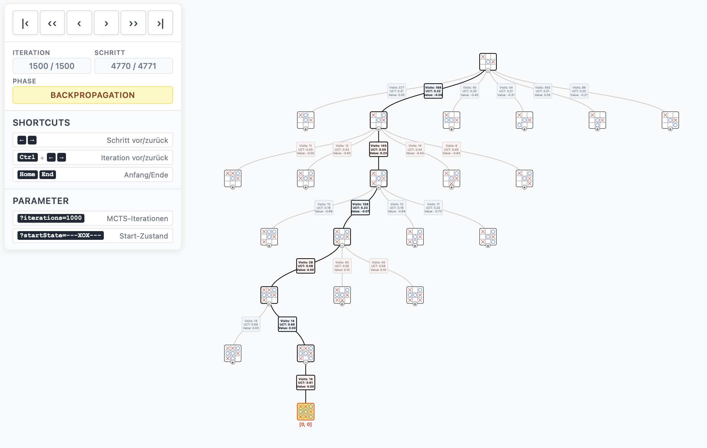

# mcts-visual

Diese Anwendung ist eine interaktive Demonstration des Monte Carlo Tree Search (MCTS) anhand des Spiels Tic-Tac-Toe. Sie entstand im Rahmen meiner Abschlussarbeit "Adaption von MCTS und AlphaZero für Spiele mit imperfekter Information am Beispiel Doppelkopf" an der Fernuniversität in Hagen unter Betreuung von Dr. Fabio Valdés und wurde in der Abschlusspräsentation verwendet.

Das vollständige Projekt zur Abschlussarbeit ist verfügbar unter: [master_doko_reinforcement_learning](https://github.com/theodm/master_doko_reinforcement_learning)

## Live-Anwendung

Die Anwendung ist online verfügbar unter: https://theodm.github.io/mcts-visual/

## Screenshots



## Benutzung

### Parameter

Die Anwendung kann über URL-Parameter konfiguriert werden:

- **`?iterations=1000`** - Anzahl der MCTS-Iterationen (Standard: 1500)
- **`?startState=---XOX---`** - Definiert den Startzustand des Tic-Tac-Toe-Bretts
  - 9 Zeichen repräsentieren die Felder von links nach rechts, oben nach unten
  - `-` = leeres Feld, `X` = Spieler X, `O` = Spieler O
  - Beispiel: `?startState=-X-O-----` für ein Spiel mit X in Position 2 und O in Position 4

### Funktionalitäten

#### MCTS-Phasen
Die Visualisierung zeigt die vier Hauptphasen des MCTS-Algorithmus:

- **Start** - Initialer Zustand
- **Selection** - Auswahl des vielversprechendsten Knotens basierend auf UCT-Werten
- **Expansion** - Hinzufügung neuer Kindknoten
- **Simulation** - Zufällige Spielsimulation bis zum Ende
- **Backpropagation** - Rückpropagierung der Ergebnisse
- **Done** - Algorithmus beendet

#### Baum-Visualisierung
- **Knoten** zeigen Tic-Tac-Toe-Spielzustände
- **Kanten** zeigen UCT-Werte, Besuche und Durchschnittswerte
- **Hervorhebungen** markieren aktuelle Pfade und wichtige Knoten
- **Erweitern/Minimieren** von Teilbäumen durch Klick auf +/- Buttons

#### Status-Informationen
- **Iteration**: Aktuelle MCTS-Iteration
- **Schritt**: Aktueller Visualisierungsschritt
- **Phase**: Aktuelle MCTS-Phase

### Tastenkombinationen

| Tastenkombination | Funktion |
|-------------------|----------|
| `←` / `→` | Einen Schritt vor/zurück |
| `Ctrl + ←` / `Ctrl + →` | Zur vorherigen/nächsten Iteration (in gleicher Phase) springen |
| `Home` | Zum Anfang springen |
| `End` | Zum Ende springen |

### Navigation
- **|‹** - Zum Anfang (Home)
- **‹‹** - Vorherige Iteration (Ctrl+←)
- **‹** - Einen Schritt zurück (←)
- **›** - Einen Schritt vor (→)
- **››** - Nächste Iteration (Ctrl+→)
- **›|** - Zum Ende (End)

## Entwicklung
### Voraussetzungen
- Node.js (Version 18 oder höher)
- npm

### Projekt einrichten
1. Repository klonen:
   ```bash
   git clone <repository-url>
   cd mcts-visual
   ```

2. Abhängigkeiten installieren:
   ```bash
   npm install
   ```

### Entwicklung starten

Entwicklungsserver starten:
```bash
npm run dev
```

Die Anwendung ist dann unter `http://localhost:5173` verfügbar.

### Build erstellen

Produktions-Build erstellen:
```bash
npm run build
```

Die Build-Ausgabe wird im `dist/` Verzeichnis erstellt.

## Inspiration
Die Inspiration für diese Visualisierung stammt von [https://vgarciasc.github.io/mcts-viz/](https://vgarciasc.github.io/mcts-viz/).